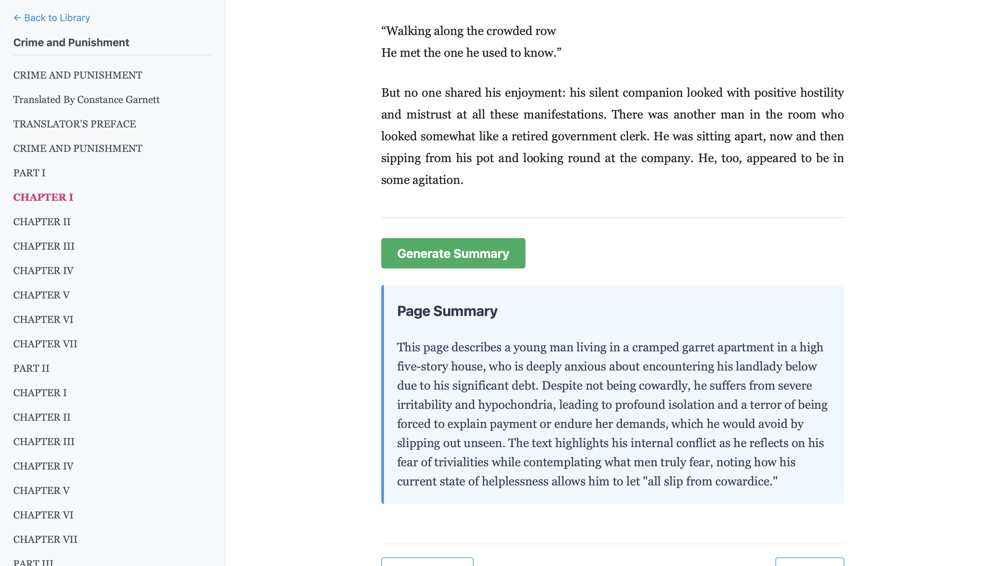

# reader 3



A lightweight, self-hosted EPUB reader for reading one chapter at a time and optionally generating local AI summaries.

This repository is a fork of Andrej Karpathy's original "reader 3" demo — adapted to add a local, privacy-first summarization feature that runs on your machine using Ollama and a lightweight Qwen model so you can read and summarize on the go.

**Why this fork exists**
- **Forked from**: Andrej Karpathy's original project, kept simple and minimal so it remains easy to run and adapt.
- **Local-first summarization**: I chose **Ollama** to run models locally (no cloud keys), and **qwen3:4b** as the default model because it's small enough for many people to run on personal machines while providing useful summaries.
- **Reading on the go**: The app is intentionally minimal—run it on a laptop or small server and access it from your phone or tablet on the same network.

**What I changed in this fork**
- Added a summarization button in the reader UI (`templates/reader.html`) that requests page summaries.
- Implemented `summarizer.py` which uses a LangGraph workflow and calls Ollama to run `qwen3:4b`.
- Hooked the summarizer into the backend via the FastAPI endpoint `/api/summarize/{book_id}/{chapter_index}` in `server.py`.

Install and run Ollama, and pull the model used by this fork:

```bash
# Start Ollama server (runs on http://localhost:11434)
ollama serve

# Pull the lightweight model many can run locally
ollama pull qwen3:4b

```

## Original Book Usage

The project uses [uv](https://docs.astral.sh/uv/). So for example, download [Dracula EPUB3](https://www.gutenberg.org/ebooks/345) to this directory as `dracula.epub`, then:

```bash
uv run reader3.py dracula.epub
```

This creates the directory `dracula_data`, which registers the book to your local library. We can then run the server:

```bash
uv run server.py
```

And visit [localhost:8123](http://localhost:8123/) to see your current Library. You can easily add more books, or delete them from your library by deleting the folder. It's not supposed to be complicated or complex.

## Contributing / Running Locally
- This fork is intentionally small and experimental. Feel free to modify the summarizer prompt in `summarizer.py` or swap models.
- If you improve things and want to share, open a PR against this fork.


## License

MIT